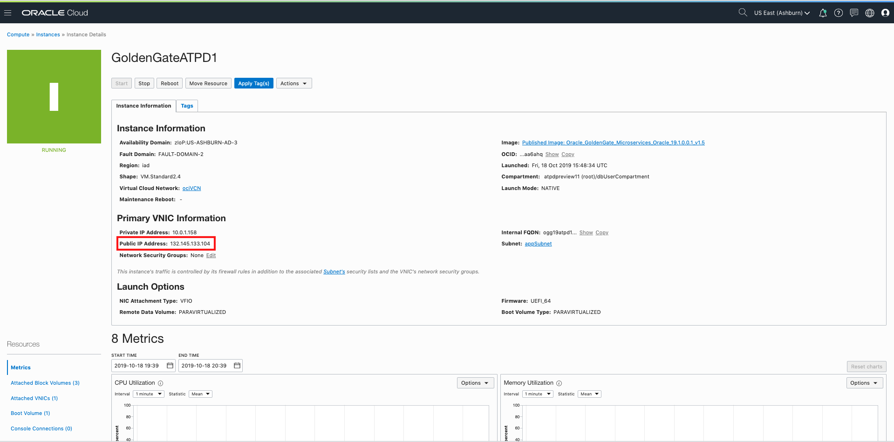

<table class="tbl-heading"><tr><td class="td-logo">

Dec 22, 2020
</td>
<td class="td-banner">
# Setting up initial load on GoldenGate to migrate the Data from On-Premise Database To Autonomous DB
</td></tr><table>

## Introduction

Oracle GoldenGate offers a real-time, log-based change data capture (CDC) and replication software platform to meet the needs of today’s transaction-driven applications. The software provides capture, routing, transformation, and delivery of transactional data across heterogeneous environments in real time. Oracle GoldenGate only captures and moves committed database transactions to insure that transactional integrity is maintained at all times. The application carefully ensures the integrity of data as it is moved from the source
database or messaging system, and is applied to any number of target databases or messaging systems.

Why would you use Oracle Golden Gate?

Oracle GoldenGate 12c offers several key advantages:
- » Continuous, real-time data movement with low latency
- » Negligible impact and overhead on source and target systems
- » No requirement for a middle-tier server
- » Tight integration with Oracle Data Integrator Enterprise Edition for complex transformations
- » No downtime for batch processing
- » Complete data recoverability in case of outages or failures
- » Read-consistent data movement while maintaining referential integrity
- » Ability to apply transformations and mappings within the target database
- » Ability to use the same product in different topologies for different solutions such    as continuous availability and zero-downtime upgrades and migrations

[Learn More](http://www.oracle.com/us/products/middleware/data-integration/oracle-goldengate-realtime-access-2031152.pdf)

To **log issues**, click [here](https://github.com/cloudsolutionhubs/autonomous-transaction-processing/issues/new) to go to the github oracle repository issue submission form.

## Objectives

- Provision Golden Gate Classic Edition from Oracle Cloud Marketplace
- Configure extract and replicat processes on golden gate instance respectively.
- Configure Source and Target Database for Goldengate.
- Trigger initial load process on Goldengate to migrate data from on-premise to cloud.

## Required Artifacts

-   The following lab requires an Oracle Cloud account. You may use your own cloud account, a cloud account that you obtained through a trial, or a training account whose details were given to you by an Oracle instructor.
- Access to OCI console
- Access to on-premise source database with admin access.
- A pre-provisioned Autonomous Database as target database.


## Steps

### **STEP 1: Provisioning and Configuring the Golden Gate Classic Edition Image from OCI Marketplace**

**To provision the Golden Gate Classic Image, please follow the below steps:**

1. Login to OCI Console


2. Click on the Hamburger menu on the top left corner of the screen.

3. Scroll down and select the Market place option from the menu.


4. Now you will see the market place console. On the left side of the screen, in the type dropdown menu, filter using data integration option.


5. Select the Golden Gate Image.


6. Select the Goldengate Edition and the compartment to deploy the golden gate image and click on Launch Stack button.


7. This GoldenGate Classic image is deployed as a stack using terraform to automate the linux instance and Golden Gate installation. Enter the name for the stack that is going to be deployed. Please note that you need service limit to be available on your tenancy for VM shape 2.1 (minimum), to be able to provision this image.


8. Click next.

9. Enter the display name for the compute instance which is going to be provisioned as a part of this stack to install golden gate software.

10. Enter a DNS host name for this instance.

11. Select the compartment, VCN and the subnet where the compute instance needs to be provisioned.


12. select the Availability Domain and the shape. For our usecase, we are going to select the checkbox "assign public ip address" as this compute instance needs to be in a public subnet to be able to access both the source and the target database.

13. Give the name and select the database version for source and target deployments.

    Note : 
    1. For Autonomous DB as target deployments, leave the deployment 2 name empty and select the checkbox and the autonomous database to which you want to replicate.

14. Enter your ssh-key and click next, review the values entered and click submit.


15. Once the stack is provisioned, navigate to compute instances from the hamburger menu and get the IP address of the Compute Instance.





### **STEP 2: Configuring the Golden Gate instance**

In the Oracle GoldenGate On Premises instance, you need to complete the following:


**Steps**

1. SSH into your Oracle GoldenGate instance, the following are the variables pre-configured in Goldengate instance:

    ```
    $ ssh -i <private key> opc@<public_ip_address>
    ```

    ```
    TNS_ADMIN=/u02/deployments/oracle##
    GGHOME=/home/opc
    ```

    Note : 
    1. In TNS_ADMIN variable, oracle## is the GG deployment version (11, 12, 18, 19). Always use the 19 version deployment unless you have a requirement which restricts you.
    2. We need to place the TNSNAMES.ora which has the DB connection details OR the complete wallet contents (if using Autonomous DB) in the TNS_ADMIN directory.


2. Setting up the connection to source and target dbs from Goldengate instance.

    - Transfer the credentials ZIP file that you downloaded from Oracle Autonomous Database cloud console to your Oracle GoldenGate instance.
    - Unzip the credentials file into the TNS_ADMIN directory.
    - You should see various wallet files along with tnsnames.ora file.
    - Open the TNSNAMES.ORA file then paste the TNSNAMES.ORA file entry from the source database into this file.

    
    

3. Login to the Goldengate console and verify if all the necessary directories are pre-created.

    - change directory to /home/opc

        ```
        cd /home/opc
        ```

    - login to the golden gate console
    
        ```
        ggsci oracle##
        ```

        Note : In the above command, oracle## is the Goldengate version you want to use for your deployment. By default, 4 versions are installed, i.e 11, 12, 18, 19. if you want to use the Goldengate 19c version, the command is as follows:

        ```
        ggsci oracle19
        ```

    - Create the subdirectories needed to configure the extract processes.

        ```
        GGSCI >  create subdirs
        ```

        

4. Create user id  and alias in Goldengate instance for source and target db users.
    
    - SSH into the Goldengate VM if you have not already

    ```
    $ ssh -i <private key> opc@<public_ip_address>
    ```

    - Log into the Goldengate Console

    ```
    $ cd /usr/local/bin
    $ ./ggsci oracle<##>
    ```

    - Create the Oracle GoldenGate wallet and add the user credentials to the credential store and assign alias to the users.

        ```
        GGSCI> Create Wallet
        GGSCI> add credentialstore
        # CDB user for Source DB
        GGSCI> Alter credentialstore ADD USER C##user01 PASSWORD WElCome12_34# alias cappschema domain OracleGoldenGate
        # PDB user for Source DB
        GGSCI> Alter credentialstore ADD USER appschema PASSWORD WElCome12_34# alias pappschema domain OracleGoldenGate
        # User for Autonomous DB
        GGSCI> Alter credentialstore ADD USER ggadmin PASSWORD WElCome12_34# alias targetggadmin domain OracleGoldenGate
        # Connect to source CDB user
        GGSCI> DBLOGIN USERIDALIAS cappschema domain OracleGoldenGate
        # Connect to source PDB user
        GGSCI> DBLOGIN USERIDALIAS pappschema domain OracleGoldenGate
        # Connect to Autonomous DB user
        GGSCI> DBLOGIN USERIDALIAS targetggadmin domain OracleGoldenGate
        ```


        Note : 
        1. If you DO NOT want to assign an alias to the user, skip the alias parameter from the command
        2. In every Autonomous DB, there is a pre-defined user named "GGADMIN" which has the necessary previliges assigned to work with Oracle Goldengate instance. We just need to activate the account and enable few previliges.

        
        
        
        
        
        
        

5. Create the extract process.

    Note : You can either use the username and password or a user id alias if created.

    - SSH into the Goldengate VM if you have not already

    ```
    $ ssh -i <private key> opc@<public_ip_address>
    ```

    - Log into the Goldengate Console

    ```
    $ cd /usr/local/bin
    $ ./ggsci oracle<##>
    ```

    - Configure the initial load extract parameters


    ```
    ggsci >  edit param <extract_name>
    ```

    For Example : 

    ```
    ggsci > edit param ext1
    ```

    - Enter the below contents in the file and save the file.

    ```
    extract <extract_name>
    userid <Username>, password <password>
    --useridalias <user_alias>
    DISCARDFILE ./dirout/exp1.txt , APPEND, MEGABYTES 500
    EXTFILE ./dirdat/zp , MAXFILES 999, MEGABYTES 500, PURGE
    table <pdb>.<schema>.*;
    ```

    For Example : 

    ```
    extract ext1
    --userid C##user01, password WElCome12_34#
    useridalias cappschema
    DISCARDFILE ./dirout/exp1.txt , APPEND, MEGABYTES 500
    EXTFILE ./dirdat/zp , MAXFILES 999, MEGABYTES 500, PURGE
    table PDB1.APPSCHEMA.*;
    ```

    


    - Login to the Source Database PDB from GGSCI console

    ```
    ggsci > dblogin useridalias <pdb_alias_name> domain OracleGoldenGate
    ```

    For Example : 

    ```
    ggsci > dblogin useridalias pappschema domain OracleGoldenGate
    ```

    
6. Add and register the extract and the trail processes.

    ```
    ggsci > add extract <extract_name>, sourceistable
    ```

    For example : 

    ```
    ggsci > add extract ext1, sourceistable
    ```

    Note : 
    1. If the database is Multitenant database (i.e it uses a CDB/PDB model), only integrated/initial load extract is supported.
    2. Classic extract is deprecated from Oracle Goldengate version 18c amd is not supported.

    

7. In the source database PDB, setup trandata configuration.

    - Connect to the source database from Goldengate and add schema trandata

    ```
    ggsci > dblogin useridalias pappschema
    ggsci > add schematrandata abdul.supplier
    ```

    Note : 
    1. if you using a CDB user to setup schema trandata, you have to mention the PDB name as well as mentioned below.

    ```
    ggsci > dblogin useridalias pappschema
    ggsci > add trandata pdb1.abdul.supplier
    ```

    

8. Login to the target autonomous database and setup checkpoint table and heartbeat table.

    - SSH into the Goldengate VM if you have not already

    ```
    $ ssh -i <private key> opc@<public_ip_address>
    ```

    - Log into the Goldengate Console

    ```
    $ cd /usr/local/bin
    $ ./ggsci oracle<##>
    ```

    - Connect to the source database and setup schema trandata

    ```
    ggsci > dblogin useridalias <target db alias>
    ggsci > add checkpointtable <schema>.<checkpoint table name>
    ggsci > add heartbeattable
    ```

    For Example : 

    ```
    ggsci > dblogin useridalias targetggadmin
    ggsci > add checkpointtable appschema.checkpointtable
    ggsci > add heartbeattable
    ```

    

    - configure the replicat parameters

    ```
    ggsci >  edit param <replicat_name>
    ```

    For Example : 

    ```
    ggsci > edit param rep1
    ```

    - Enter the below contents in the file and save the file.

    ```
    SPECIALRUN
    END RUNTIME
    USERIDALIAS <target db alias>
    ASSUMETARGETDEFS
    EXTFILE ./dirdat/zp
    DISCARDFILE ./dirout/rep1.txt, PURGE
    MAP <pdb>.<schema>.*, TARGET <schema>.*;
    ```

    For Example : 

    ```
    SPECIALRUN
    END RUNTIME
    USERIDALIAS targetggadmin
    ASSUMETARGETDEFS
    EXTFILE ./dirdat/zp
    DISCARDFILE ./dirout/rep1.txt, PURGE
    MAP pdb1.appschema.*, TARGET appschema.*;
    ```

    


9. Edit the manager parameter file and configure the manager process. The contents are as follows : 

    ```
    PORT <MGR PORT>
    ACCESSRULE, PROG *, IPADDR *, ALLOW
    ```

    For example : 

    ```
    PORT 10019
    ACCESSRULE, PROG *, IPADDR *, ALLOW
    ```


10. Stop and start the manager and confirm that it started.

    ```
    GGSCI > stop mgr
    GGSCI > start mgr
    GGSCI > info mgr
    ```

    

### **STEP 3: Configuring the Source Database instance**

In the Oracle Source Database instance, you need to complete the following:


**Steps**

1. Login to the database

    - SSH into the DB VM
    
        ```
        $ ssh -i private_key opc@IP_address_of_your_instance
        ```

    - Change user to oracle.

        ```
        $ sudo su - oracle
        ```

    - Connect to the database 

        ```
        $ sqlplus / as sysdba
        ```


2. Create a common user in the container and grant golden gate previliges to the user.

    ```
    SQL > create user C##user01 identified by WElCome12_34#;
    SQL > exec dbms_goldengate_auth.grant_admin_privilege('C##user01',container=>'all');
    SQL > grant dba to C##user01;
    SQL > grant dba to pdb1.appschema;
    SQL > show parameter ENABLE_GOLDENGATE_REPLICATION;
    SQL > alter system set ENABLE_GOLDENGATE_REPLICATION=true scope=both;
    SQL > ALTER DATABASE ADD SUPPLEMENTAL LOG DATA;
    SQL > GRANT UNLIMITED TABLESPACE TO C##user01;
    SQL > GRANT UNLIMITED TABLESPACE TO pdb1.appschema;
    ```

3. Verify the data to be migrated.

    - Change the session to the PDB where we have the data to be migrated.
    ```
    SQL > alter session set container=<pdb_name>
    ```

    For example : 

    ```
    SQL > alter session set container=pdb1
    ```

    - Check the tables and/or database objects to be migrated.

    ```
    SQL > SELECT table_name, owner FROM all_tables WHERE owner='schema_name' ORDER BY owner, table_name
    ```

    Note : 
    1. Please note that the string 'schema_name' is case-sensitive.

    


### **STEP 3: Configuring the target database instance**

In the Oracle GoldenGate target instance, you need to complete the following:


**Steps**

1. Login to the database

    - Connect to the Autonomous DB either using SQL Developer or SQL Client.
    
    

5. Create a new user for replication.

    ```
    drop user appschema cascade;
    create user appschema identified by WElCome12_34#;
    grant create session, resource, create view, create table to appschema;
    alter user appschema quota unlimited on data;
    ```

6. Unlock GGADMIN user and grant necessary previliges.

    ```
    alter user ggadmin identified by WElCome12_34# account unlock;
    alter user ggadmin quota unlimited on data;

7.  Make sure the DDL has been executed on the target database for the tables that have to be migrated.

    ```
    SQL > SELECT table_name, owner FROM all_tables WHERE owner='APPSCHEMA' ORDER BY owner, table_name
    ```

    


### **STEP 4: Trigger the replication process and verify the data migration**

In the Oracle GoldenGate source and target instance, you need to complete the following:


**Steps**

1. Make sure the mgr is running and start it if it is not running on golden gate instance.

    ```
    GGSCI > info mgr
    ```
    

2. On the Golden Gate instance, start the extract process.

    ```
    $ pwd
    /home/opc
    $ ls
    oracle11 oracle12 oracle18 oracle19
    $ cd oracle19
    $ ./extract paramfile dirprm/<extract parameter file> reportfile dirrpt/<extract report file>
    ```

    For example : 

    ```
    $ pwd
    /home/opc
    $ ls
    oracle11 oracle12 oracle18 oracle19
    $ cd oracle19
    $./extract paramfile dirprm/ext1.prm reportfile dirrpt/exp1.rpt
    ```

    

3. Verify, if the extract is running

    ```
    GGSCI > info all
    ```

    

4. Let the extract process complete, once done, verify if the stats has been updated by the extract process.

    ```
    GGSCI > cat dirrpt/exp1.rpt
    ```

    
    

5. Start the replicat process

    ```
    $ pwd
    /home/opc
    $ ls
    oracle11 oracle12 oracle18 oracle19
    $ cd oracle19
    $ ./replicat paramfile dirprm/rep1.prm reportfile dirrpt/rep1.rpt
    $ cat dirrpt/rep1.rpt
    ```

    
    

6. Login to the target database and verify that the data has been replicated.

    
    


-   You have now successfully migrated the data using Goldengate Initial Load Method.

<table>
<tr><td class="td-logo">[](#)</td>
<td class="td-banner">
## Great Work - All Done!
</td>
</tr>
<table>